## 01.单机安装

### 1. 实验环境

2vCPU 2G HDD1:20G HDD2:30G
IP: 10.255.255.101/24
hostname: pve01.localdomain

### 2. 安装

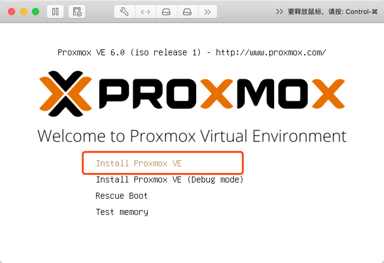

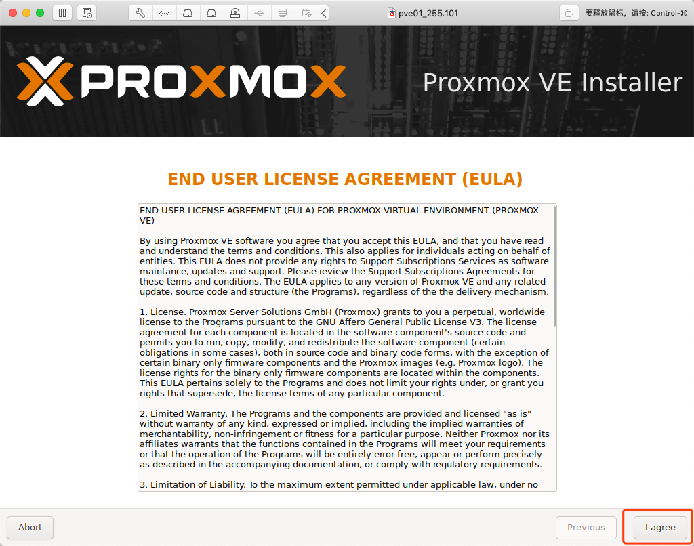

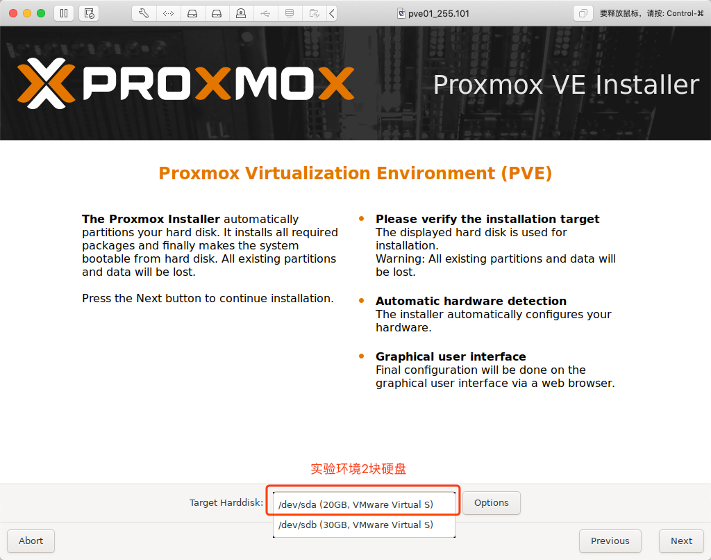

我选择XFS文件格式，默认EXT4

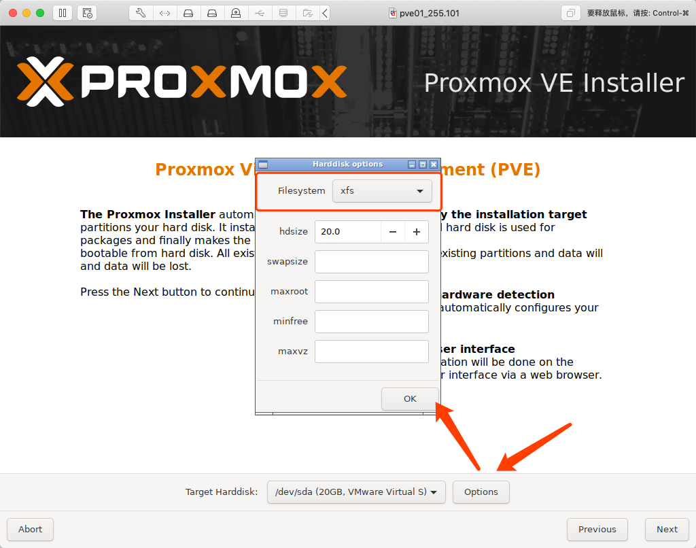

时区不解释

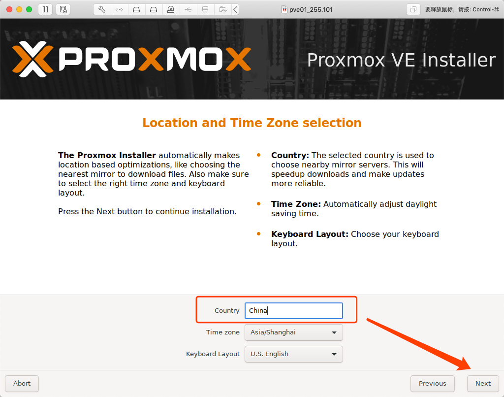

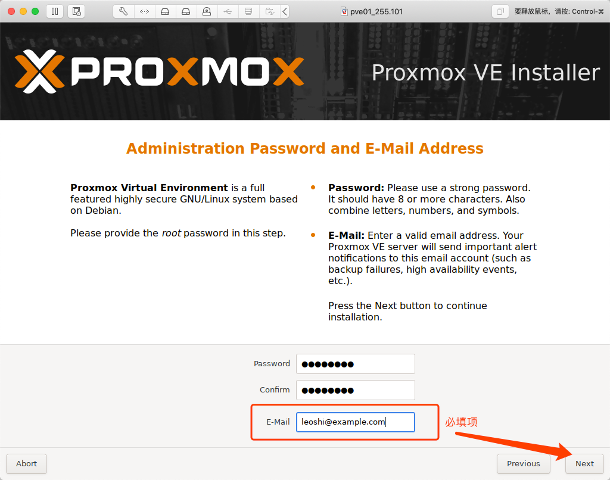

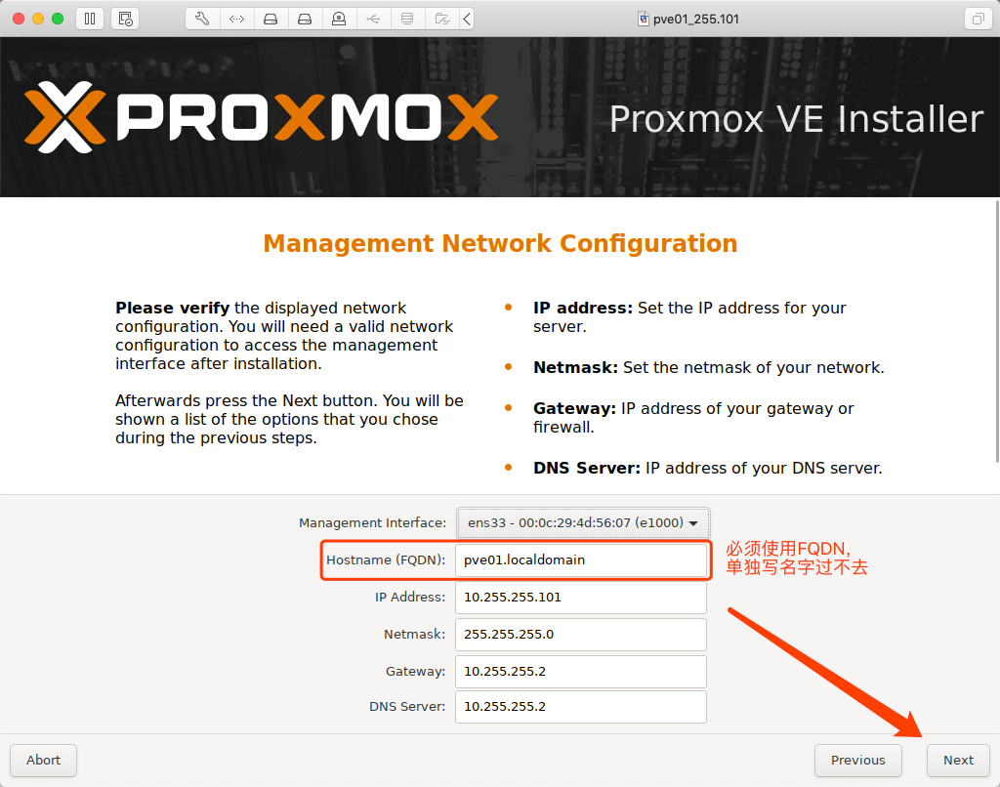

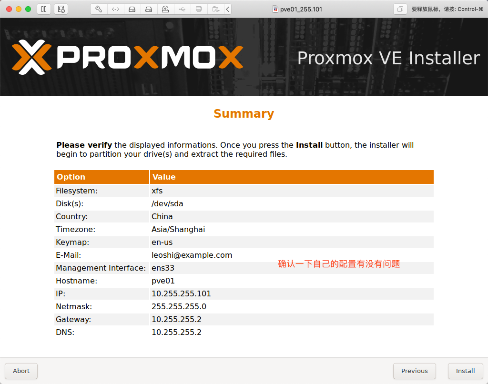

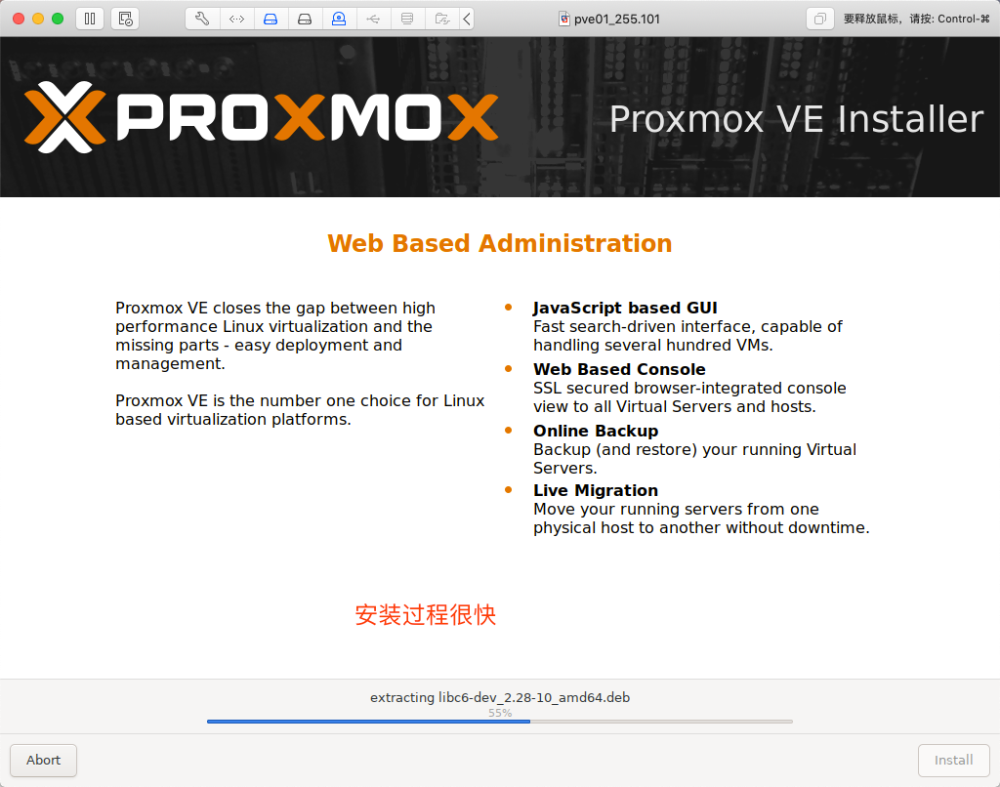

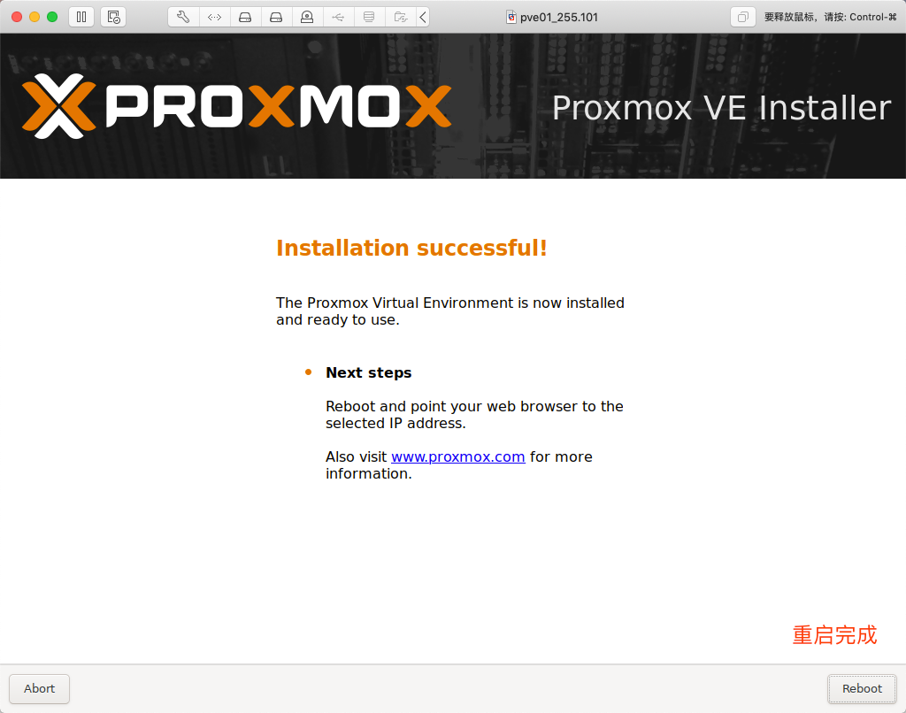

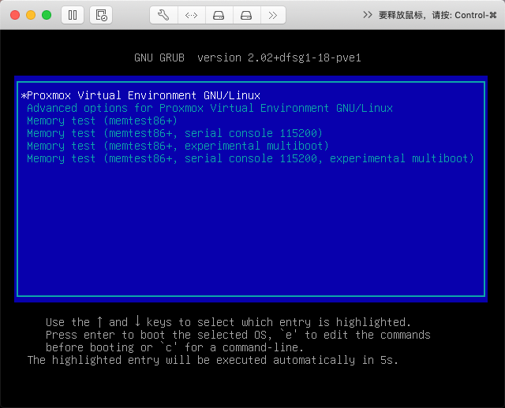

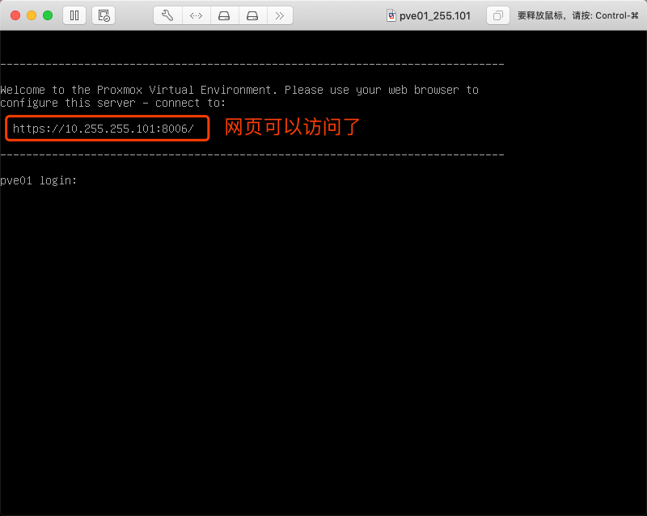

### 3. 登录

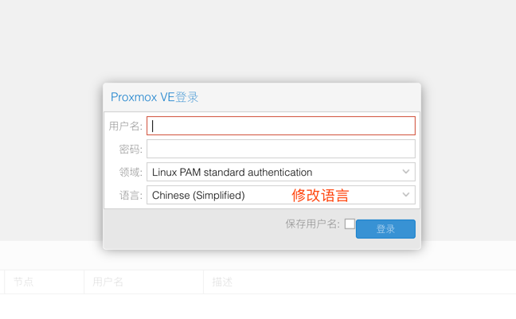

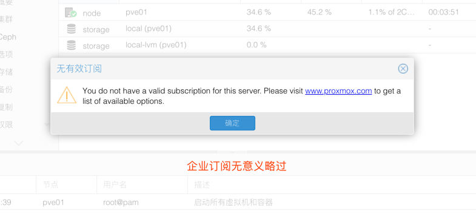

### 4. 安装完成

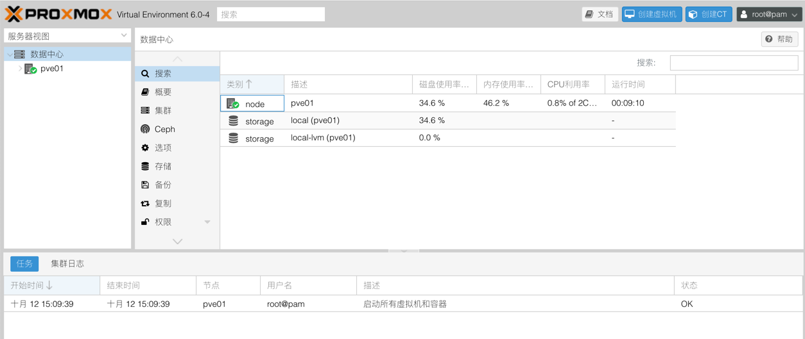

## END