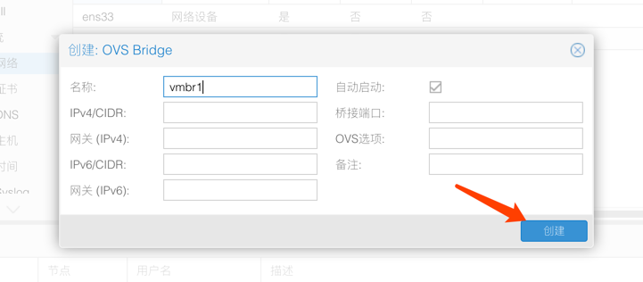

## 02.NetworkConfig

### 1. 标准网络配置


- ens33 物理网卡
- vmbr0 虚拟桥接网卡

### 2. Open vSwitch安装

> 为啥用这个，如果你是简单的网络环境没有必要，但是你的服务器会有大量的VLAN使用所以才会使用OVS


- 创建一个桥接


- 报错开始继续踩坑


````
-----秒安装 你问我为什么卡 下面有修改国内源-------------------------
root@pve01:~# apt install openvswitch-switch
Reading package lists... Done
Building dependency tree       
Reading state information... Done
The following additional packages will be installed:
  libatomic1 openvswitch-common uuid-runtime
Suggested packages:
  ethtool
The following NEW packages will be installed:
  libatomic1 openvswitch-common openvswitch-switch uuid-runtime
0 upgraded, 4 newly installed, 0 to remove and 99 not upgraded.
Need to get 2,200 kB of archives.
After this operation, 6,925 kB of additional disk space will be used.
Do you want to continue? [Y/n] y
Get:1 https://mirrors.aliyun.com/debian buster/main amd64 uuid-runtime amd64 2.33.1-0.1 [95.2 kB]
Get:2 https://mirrors.aliyun.com/debian buster/main amd64 libatomic1 amd64 8.3.0-6 [9,032 B]
Get:3 https://mirrors.aliyun.com/debian buster/main amd64 openvswitch-common amd64 2.10.0+2018.08.28+git.8ca7c82b7d+ds1-12 [2,045 kB]
Get:4 https://mirrors.aliyun.com/debian buster/main amd64 openvswitch-switch amd64 2.10.0+2018.08.28+git.8ca7c82b7d+ds1-12 [50.4 kB]
Fetched 2,200 kB in 1s (2,006 kB/s)           
Selecting previously unselected package uuid-runtime.
(Reading database ... 45158 files and directories currently installed.)
Preparing to unpack .../uuid-runtime_2.33.1-0.1_amd64.deb ...
Unpacking uuid-runtime (2.33.1-0.1) ...
Selecting previously unselected package libatomic1:amd64.
Preparing to unpack .../libatomic1_8.3.0-6_amd64.deb ...
Unpacking libatomic1:amd64 (8.3.0-6) ...
Selecting previously unselected package openvswitch-common.
Preparing to unpack .../openvswitch-common_2.10.0+2018.08.28+git.8ca7c82b7d+ds1-12_amd64.deb ...
Unpacking openvswitch-common (2.10.0+2018.08.28+git.8ca7c82b7d+ds1-12) ...
Selecting previously unselected package openvswitch-switch.
Preparing to unpack .../openvswitch-switch_2.10.0+2018.08.28+git.8ca7c82b7d+ds1-12_amd64.deb ...
Unpacking openvswitch-switch (2.10.0+2018.08.28+git.8ca7c82b7d+ds1-12) ...
Setting up libatomic1:amd64 (8.3.0-6) ...
Setting up uuid-runtime (2.33.1-0.1) ...
Adding group `uuidd' (GID 117) ...
Done.
Warning: The home dir /run/uuidd you specified can't be accessed: No such file or directory
Adding system user `uuidd' (UID 110) ...
Adding new user `uuidd' (UID 110) with group `uuidd' ...
Not creating home directory `/run/uuidd'.
Created symlink /etc/systemd/system/sockets.target.wants/uuidd.socket → /lib/systemd/system/uuidd.socket.
Setting up openvswitch-common (2.10.0+2018.08.28+git.8ca7c82b7d+ds1-12) ...
Setting up openvswitch-switch (2.10.0+2018.08.28+git.8ca7c82b7d+ds1-12) ...
Created symlink /etc/systemd/system/multi-user.target.wants/openvswitch-switch.service → /lib/systemd/system/openvswitch-switch.service.
openvswitch-nonetwork.service is a disabled or a static unit, not starting it.
Processing triggers for systemd (241-5) ...
Processing triggers for man-db (2.8.5-2) ...
Processing triggers for libc-bin (2.28-10) ...
````
[卡的原因是你没有修改国内源](03.proxmox国内源.md)

- 你成功了没有


### 3. 配置OVS
> 注意OVS Bridge 和 Linux Bridge只能选择其一

> 一定要注意备份配置文件，否则后果自负

````
root@pve01:~# cp /etc/network/interfaces /etc/network/interfaces.bak
-----配置文件如下-------------------------
root@pve01:~# cat /etc/network/interfaces.bak
# network interface settings; autogenerated
# Please do NOT modify this file directly, unless you know what
# you're doing.
#
# If you want to manage parts of the network configuration manually,
# please utilize the 'source' or 'source-directory' directives to do
# so.
# PVE will preserve these directives, but will NOT read its network
# configuration from sourced files, so do not attempt to move any of
# the PVE managed interfaces into external files!

auto lo
iface lo inet loopback

iface ens33 inet manual

auto vmbr0
iface vmbr0 inet static
        address  10.255.255.101
        netmask  255.255.255.0
        gateway  10.255.255.2
        bridge_ports ens33
        bridge_stp off
        bridge_fd 0
````
- 清空所有网络配置只剩下物理链接


> 你敢重启试试吗？

> 不用怕 没问题


- 小企业的网络环境配完这个足矣，至于跟高级的负载，绑定用到再说吧。

### 4. 生产环境VLAN配置

> VLAN标签写上就OK了

1.物理网卡eno1 交换机物理Trunk接口


2.建立OVS Bridge


3.建立 虚拟网卡 虚拟机可以使用该VLAN


````
auto lo
iface lo inet loopback

-----1.物理网卡 eno1 交换机Trunk接口-------------------------
allow-vmbr0 eno1
iface eno1 inet manual
        ovs_type OVSPort
        ovs_bridge vmbr0

-----3.虚拟网卡-------------------------
allow-vmbr0 webgui
iface webgui inet static
        address  10.1.50.11
        netmask  24
        ovs_type OVSIntPort
        ovs_bridge vmbr0
-----VLAN ID-------------------------
        ovs_options tag=850

-----2.OVS Bridge桥接网络-------------------------
auto vmbr0
iface vmbr0 inet manual
        ovs_type OVSBridge
        ovs_ports eno1 webgui
#Nic0 C150 Gi0/22
````

## END
