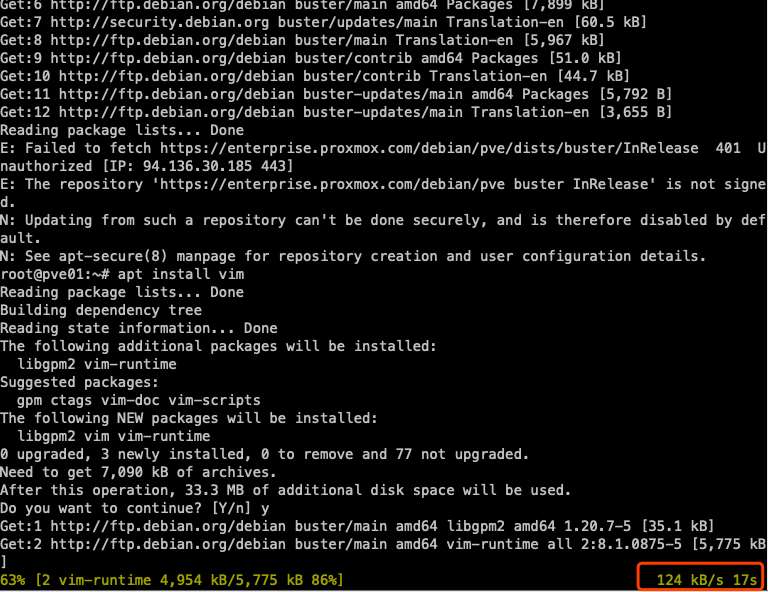

## 03.修改Proxmox国内源

### 1. 为什么修改国内源
> 不解释你懂得

### 2. 采坑开始

> debian的编辑器不好用，个人习惯使用VIM，先安装个VIM小试牛刀

#### 2.1 安装vim

> 使用SSH登录到你的服务器

````
-----上来就报错唉-------------------------
root@pve01:~# apt install vim
Reading package lists... Done
Building dependency tree       
Reading state information... Done
Package vim is not available, but is referred to by another package.
This may mean that the package is missing, has been obsoleted, or
is only available from another source

E: Package 'vim' has no installation candidate

-----apt update 升级一下看看-------------------------
root@pve01:~# apt update
Err:1 https://enterprise.proxmox.com/debian/pve buster InRelease                          
  401  Unauthorized [IP: 94.136.30.185 443]
Get:2 http://security.debian.org buster/updates InRelease [39.1 kB]                       
Get:3 http://security.debian.org buster/updates/main amd64 Packages [98.2 kB]             
Get:4 http://ftp.debian.org/debian buster InRelease [122 kB]                              
Get:5 http://ftp.debian.org/debian buster-updates InRelease [49.3 kB]                     
Get:6 http://ftp.debian.org/debian buster/main amd64 Packages [7,899 kB]                  
Get:7 http://security.debian.org buster/updates/main Translation-en [60.5 kB]             
Get:8 http://ftp.debian.org/debian buster/main Translation-en [5,967 kB]                  
Get:9 http://ftp.debian.org/debian buster/contrib amd64 Packages [51.0 kB]                
Get:10 http://ftp.debian.org/debian buster/contrib Translation-en [44.7 kB]               
Get:11 http://ftp.debian.org/debian buster-updates/main amd64 Packages [5,792 B]          
Get:12 http://ftp.debian.org/debian buster-updates/main Translation-en [3,655 B]          
Reading package lists... Done                                                             
E: Failed to fetch https://enterprise.proxmox.com/debian/pve/dists/buster/InRelease  401  Unauthorized [IP: 94.136.30.185 443]
E: The repository 'https://enterprise.proxmox.com/debian/pve buster InRelease' is not signed.
N: Updating from such a repository can't be done securely, and is therefore disabled by default.
N: See apt-secure(8) manpage for repository creation and user configuration details.

````


````
-----安装成功 但是网速 主要是后面会有很多ceph ovs 安装，一定要换资源-------------------------
root@pve01:~# apt install vim
Reading package lists... Done
Building dependency tree       
Reading state information... Done
The following additional packages will be installed:
  libgpm2 vim-runtime
Suggested packages:
  gpm ctags vim-doc vim-scripts
The following NEW packages will be installed:
  libgpm2 vim vim-runtime
0 upgraded, 3 newly installed, 0 to remove and 77 not upgraded.
Need to get 7,090 kB of archives.
After this operation, 33.3 MB of additional disk space will be used.
Do you want to continue? [Y/n] y
Get:1 http://ftp.debian.org/debian buster/main amd64 libgpm2 amd64 1.20.7-5 [35.1 kB]
Get:2 http://ftp.debian.org/debian buster/main amd64 vim-runtime all 2:8.1.0875-5 [5,775 kB]
Get:3 http://ftp.debian.org/debian buster/main amd64 vim amd64 2:8.1.0875-5 [1,280 kB]    
Fetched 7,090 kB in 54s (130 kB/s)                                                        
Selecting previously unselected package libgpm2:amd64.
(Reading database ... 43342 files and directories currently installed.)
Preparing to unpack .../libgpm2_1.20.7-5_amd64.deb ...
Unpacking libgpm2:amd64 (1.20.7-5) ...
Selecting previously unselected package vim-runtime.
Preparing to unpack .../vim-runtime_2%3a8.1.0875-5_all.deb ...
Adding 'diversion of /usr/share/vim/vim81/doc/help.txt to /usr/share/vim/vim81/doc/help.txt.vim-tiny by vim-runtime'
Adding 'diversion of /usr/share/vim/vim81/doc/tags to /usr/share/vim/vim81/doc/tags.vim-tiny by vim-runtime'
Unpacking vim-runtime (2:8.1.0875-5) ...
Selecting previously unselected package vim.
Preparing to unpack .../vim_2%3a8.1.0875-5_amd64.deb ...
Unpacking vim (2:8.1.0875-5) ...
Setting up libgpm2:amd64 (1.20.7-5) ...
Setting up vim-runtime (2:8.1.0875-5) ...
Setting up vim (2:8.1.0875-5) ...
update-alternatives: using /usr/bin/vim.basic to provide /usr/bin/vim (vim) in auto mode
update-alternatives: using /usr/bin/vim.basic to provide /usr/bin/vimdiff (vimdiff) in auto mode
update-alternatives: using /usr/bin/vim.basic to provide /usr/bin/rvim (rvim) in auto mode
update-alternatives: using /usr/bin/vim.basic to provide /usr/bin/rview (rview) in auto mode
update-alternatives: using /usr/bin/vim.basic to provide /usr/bin/vi (vi) in auto mode
update-alternatives: using /usr/bin/vim.basic to provide /usr/bin/view (view) in auto mode
update-alternatives: using /usr/bin/vim.basic to provide /usr/bin/ex (ex) in auto mode
Processing triggers for man-db (2.8.5-2) ...
Processing triggers for libc-bin (2.28-10) ...
````

#### 2.2 修改配置文件
> 记得备份
````
-----备份配置文件-------------------------
root@pve01:~# cp /etc/apt/sources.list /etc/apt/sources.list.bak
````
````
root@pve01:~# vim /etc/apt/sources.list
# pve6 <--> debian buster

#deb http://ftp.debian.org/debian buster main contrib
#deb http://ftp.debian.org/debian buster-updates main contrib
# security updates
#deb http://security.debian.org buster/updates main contrib

# https needs(apt install apt-transport-https -y)
deb https://mirrors.aliyun.com/debian buster main contrib non-free
deb https://mirrors.aliyun.com/debian buster-updates main contrib non-free
deb https://mirrors.aliyun.com/debian-security buster/updates main contrib non-free

# pve6 repository: pve-no-subscription
#deb http://download.proxmox.com/debian/pve buster pve-no-subscription
#deb https://mirrors.ustc.edu.cn/proxmox/debian/pve buster pve-no-subscription
deb http://download.proxmox.wiki/debian/pve buster pve-no-subscription
````
- apt 升级又报错
````
root@pve01:~# apt update
Get:1 https://mirrors.aliyun.com/debian buster InRelease [122 kB]                         
Get:2 https://mirrors.aliyun.com/debian buster-updates InRelease [49.3 kB]                
Get:3 https://mirrors.aliyun.com/debian-security buster/updates InRelease [39.1 kB]       
Get:4 https://mirrors.aliyun.com/debian buster/main amd64 Packages [7,899 kB]             
Get:5 https://mirrors.aliyun.com/debian buster/main Translation-en [5,967 kB]             
Get:6 https://mirrors.aliyun.com/debian buster/contrib amd64 Packages [51.0 kB]           
Get:7 https://mirrors.aliyun.com/debian buster/contrib Translation-en [44.7 kB]           
Get:8 http://download.proxmox.wiki/debian/pve buster InRelease [3,051 B]                  
Get:9 https://mirrors.aliyun.com/debian buster/non-free amd64 Packages [88.0 kB]          
Get:10 http://download.proxmox.wiki/debian/pve buster/pve-no-subscription amd64 Packages [90.8 kB]
Get:11 https://mirrors.aliyun.com/debian buster/non-free Translation-en [88.7 kB]         
Get:12 https://mirrors.aliyun.com/debian buster-updates/main amd64 Packages [5,792 B]     
Get:13 https://mirrors.aliyun.com/debian buster-updates/main Translation-en [3,655 B]     
Get:14 https://mirrors.aliyun.com/debian-security buster/updates/main amd64 Packages [98.2 kB]
Get:15 https://mirrors.aliyun.com/debian-security buster/updates/main Translation-en [60.5 kB]
-----报错开始 慢慢排错吧-------------------------
Err:16 https://enterprise.proxmox.com/debian/pve buster InRelease                         
  401  Unauthorized [IP: 94.136.30.185 443]
Reading package lists... Done                                                             
E: Failed to fetch https://enterprise.proxmox.com/debian/pve/dists/buster/InRelease  401  Unauthorized [IP: 94.136.30.185 443]
E: The repository 'https://enterprise.proxmox.com/debian/pve buster InRelease' is not signed.
N: Updating from such a repository can't be done securely, and is therefore disabled by default.
N: See apt-secure(8) manpage for repository creation and user configuration details.
````
- 安装 https组件
````
root@pve01:~# apt install apt-transport-https -y
Reading package lists... Done
Building dependency tree       
Reading state information... Done
The following NEW packages will be installed:
  apt-transport-https
0 upgraded, 1 newly installed, 0 to remove and 99 not upgraded.
Need to get 149 kB of archives.
After this operation, 156 kB of additional disk space will be used.
Get:1 https://mirrors.aliyun.com/debian buster/main amd64 apt-transport-https all 1.8.2 [149 kB]
Fetched 149 kB in 0s (582 kB/s)             
Selecting previously unselected package apt-transport-https.
(Reading database ... 45154 files and directories currently installed.)
Preparing to unpack .../apt-transport-https_1.8.2_all.deb ...
Unpacking apt-transport-https (1.8.2) ...
Setting up apt-transport-https (1.8.2) ...
````
- 排错，应该是企业订阅的问题，干脆点把企业订阅干掉
````
Err:5 https://enterprise.proxmox.com/debian/pve buster InRelease
  401  Unauthorized [IP: 94.136.30.185 443]
Reading package lists... Done
E: Failed to fetch https://enterprise.proxmox.com/debian/pve/dists/buster/InRelease  401  Unauthorized [IP: 94.136.30.185 443]
E: The repository 'https://enterprise.proxmox.com/debian/pve buster InRelease' is not signed.
N: Updating from such a repository can't be done securely, and is therefore disabled by default.
N: See apt-secure(8) manpage for repository creation and user configuration details.
````
>删除之前注意备份
````
root@pve01:~# cp /etc/apt/sources.list.d/pve-enterprise.list /etc/apt/sources.list.d/pve-enterprise.list.bak
-----删除就是这么简单-------------------------
root@pve01:~# rm -rf /etc/apt/sources.list.d/pve-enterprise.list
````
- 这个世界安静了
````
root@pve01:~# apt update
Hit:1 https://mirrors.aliyun.com/debian buster InRelease
Hit:2 https://mirrors.aliyun.com/debian buster-updates InRelease
Hit:3 https://mirrors.aliyun.com/debian-security buster/updates InRelease
Hit:4 http://download.proxmox.wiki/debian/pve buster InRelease
Reading package lists... Done                            
Building dependency tree       
Reading state information... Done
99 packages can be upgraded. Run 'apt list --upgradable' to see them.
````

## END

