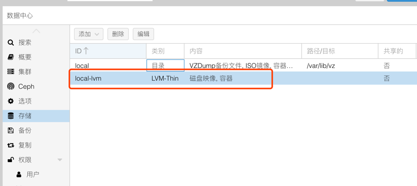
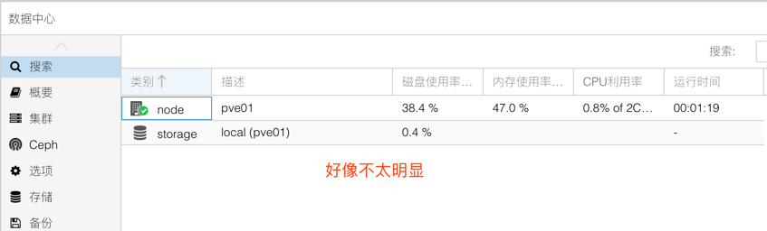
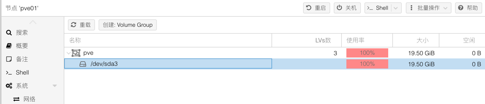

## 04.禁用LVM-Thin模式

### 1. 原因

> 在生产系统中虽然提高了硬盘的使用效率，但是大大提高了磁盘充满的风险。

### 2. 当前状态



### 3. 删除当前卷

> 注意备份配置文件

````
root@pve01:~# cp /etc/pve/storage.cfg /etc/pve/storage.cfg.bak
````

### 4. 修改配置文件

````
root@pve01:~# vim /etc/pve/storage.cfg
dir: local
        path /var/lib/vz
        maxfiles 0
        content backup,iso,vztmpl,rootdir,images
````

### 5. 重建LVM卷

````
-----查看当前卷的状态-------------------------
root@pve01:~# lvs
  LV   VG  Attr       LSize  Pool Origin Data%  Meta%  Move Log Cpy%Sync Convert
  data pve twi-a-tz-- <8.00g             0.00   1.58                            
  root pve -wi-ao----  4.75g                                                    
  swap pve -wi-ao---- <2.38g
-----删除逻辑卷-------------------------
root@pve01:~# lvremove pve/data
Do you really want to remove and DISCARD active logical volume pve/data? [y/n]: y
  Logical volume "data" successfully removed 
-----重新创建逻辑卷-------------------------
root@pve01:~# lvcreate --name data -l +100%FREE pve
  Logical volume "data" created. 
-----格式化xfs文件格式-------------------------
root@pve01:~# mkfs.xfs /dev/pve/data 
meta-data=/dev/pve/data          isize=512    agcount=4, agsize=810752 blks
         =                       sectsz=512   attr=2, projid32bit=1
         =                       crc=1        finobt=1, sparse=1, rmapbt=0
         =                       reflink=0
data     =                       bsize=4096   blocks=3243008, imaxpct=25
         =                       sunit=0      swidth=0 blks
naming   =version 2              bsize=4096   ascii-ci=0, ftype=1
log      =internal log           bsize=4096   blocks=2560, version=2
         =                       sectsz=512   sunit=0 blks, lazy-count=1
realtime =none                   extsz=4096   blocks=0, rtextents=0                                                  
````

### 6. 开机挂载编辑 /etc/fstab

````
root@pve01:~# vim /etc/fstab 
-----添加下面这行-------------------------
/dev/pve/data /var/lib/vz xfs defaults 0 1
````

> 重启吧



````
-----原磁盘-------------------------
root@pve01:~# lvs
  LV   VG  Attr       LSize  Pool Origin Data%  Meta%  Move Log Cpy%Sync Convert
  data pve twi-a-tz-- <8.00g             0.00   1.58                            
  root pve -wi-ao----  4.75g                                                    
  swap pve -wi-ao---- <2.38g
-----变更后-------------------------
root@pve01:~# lvs
  LV   VG  Attr       LSize  Pool Origin Data%  Meta%  Move Log Cpy%Sync Convert
  data pve -wi-ao---- 12.37g                                                    
  root pve -wi-ao----  4.75g                                                    
  swap pve -wi-ao---- <2.38g             
````



## END