## 06.创建VM虚拟机

### 1. 先上传ISO镜像

[05.上传安装镜像](05.上传安装镜像.md)

### 2. 创建虚拟机

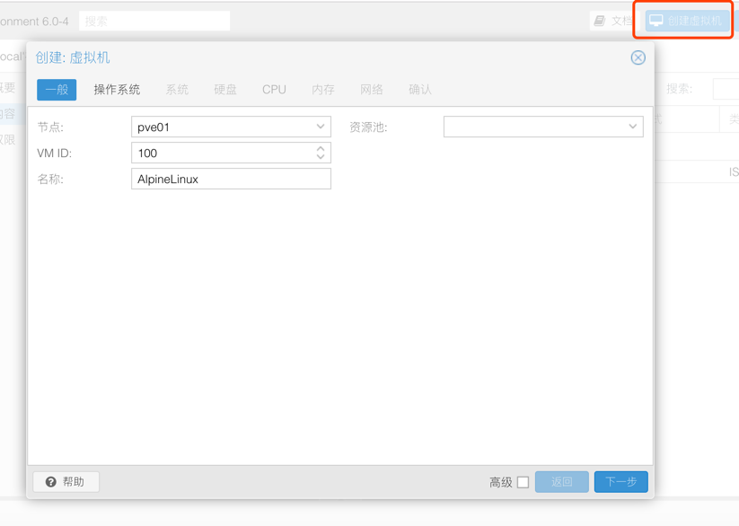

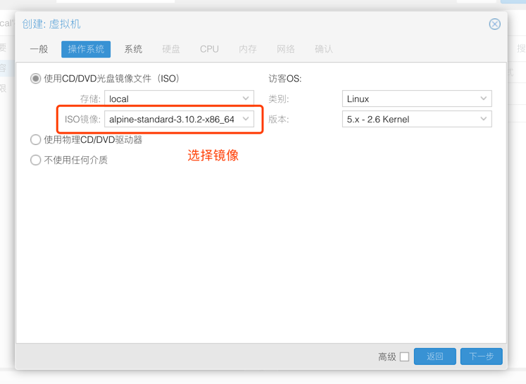

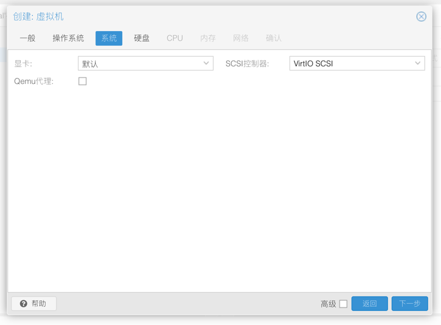

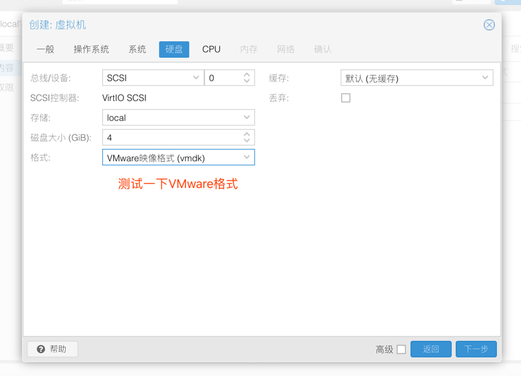

> 补充

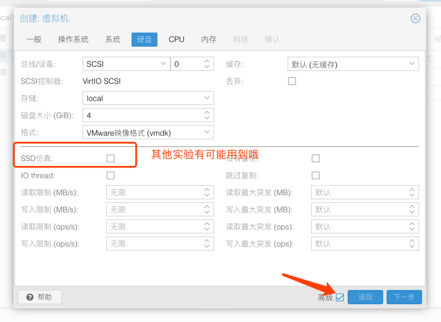

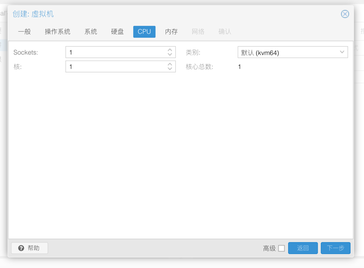

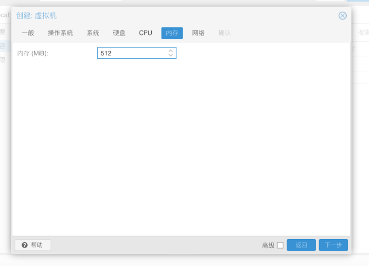

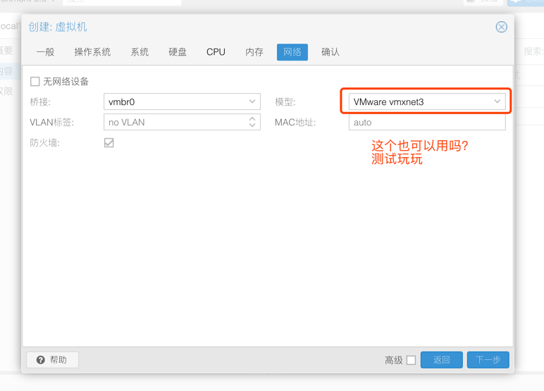

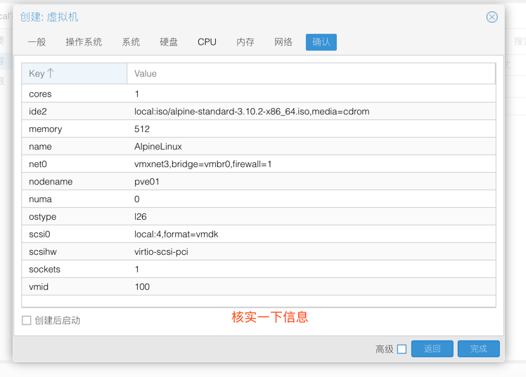

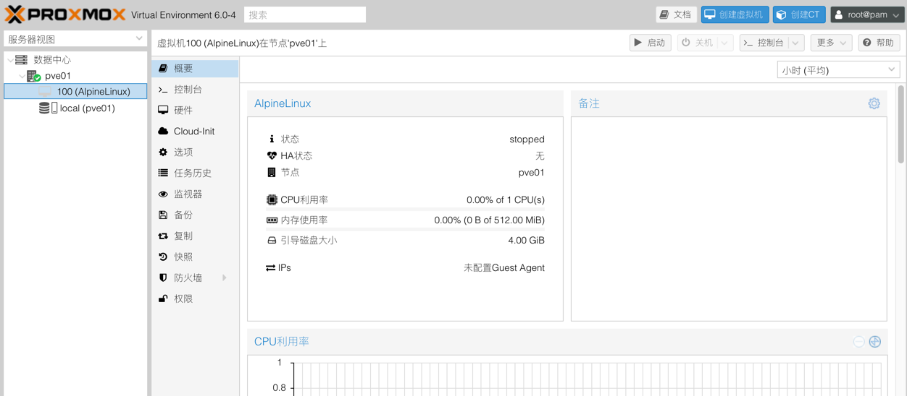

### 3. 安装虚拟机

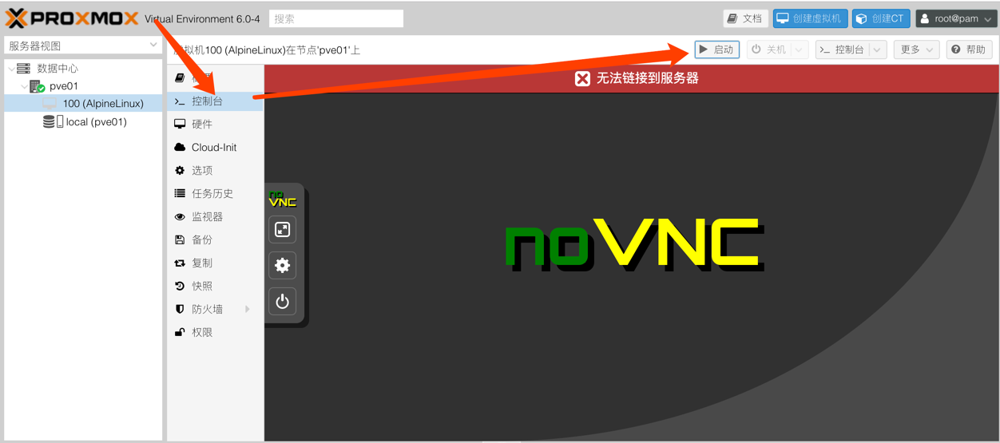

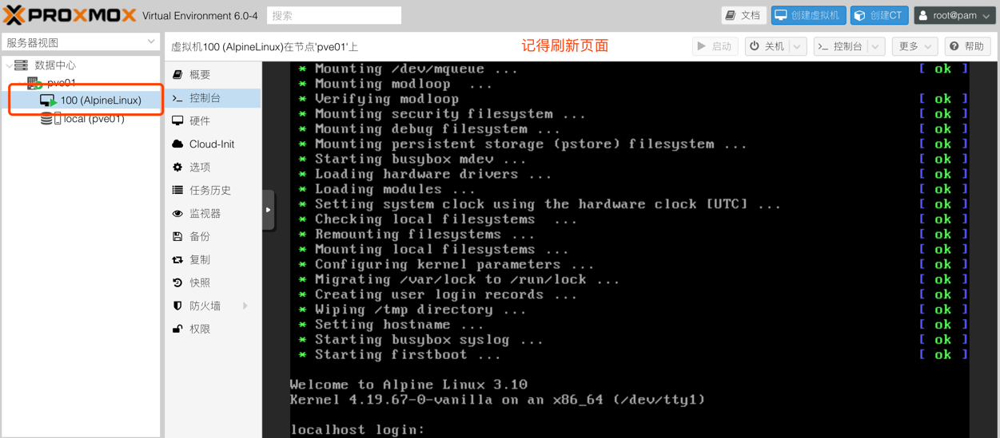

- 安装过程略过

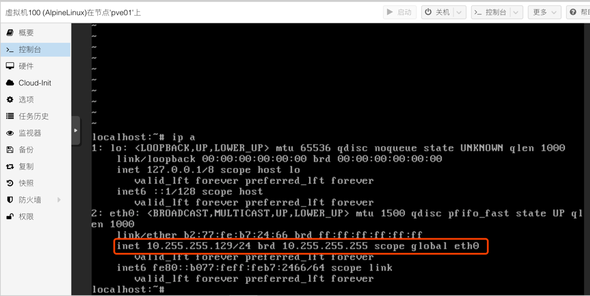

### 4. 删除VM

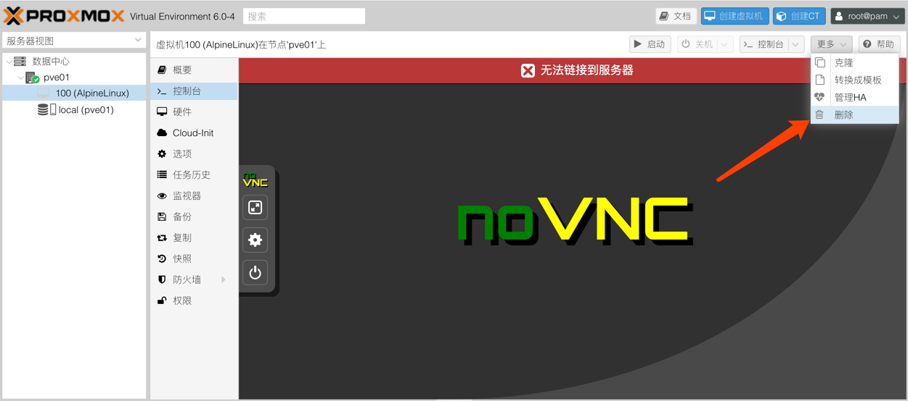

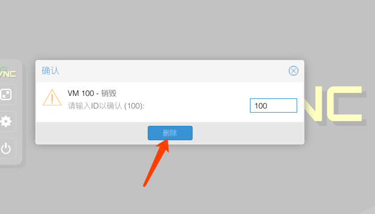

### 5. 虚拟机存放位置

````
-----虚拟机卷存放位置-------------------------
root@pve01:/var/lib/vz/images# ls -lh 100/
total 1.4G
-rw-r----- 1 root root 1.4G Oct 12 22:17 vm-100-disk-0.vmdk
-----虚拟机配置文件存放位置-------------------------
root@pve001:/etc/pve/nodes/pve001/qemu-server# pwd
/etc/pve/nodes/pve001/qemu-server
root@pve001:/etc/pve/nodes/pve001/qemu-server# ls
100.conf
````

## END