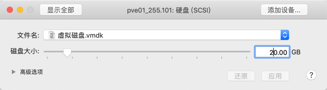
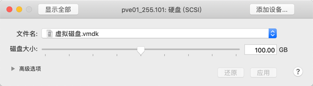

## 07.硬盘扩容

### 1. local卷扩充容量

> 初始硬盘容量20G，扩容至100G



````
root@pve01:~# lvs
  LV   VG  Attr       LSize  Pool Origin Data%  Meta%  Move Log Cpy%Sync Convert
  data pve -wi-ao---- 12.37g                                                    
  root pve -wi-ao----  4.75g                                                    
  swap pve -wi-ao---- <2.38g                                                    
root@pve01:~# pvdisplay
  --- Physical volume ---
  PV Name               /dev/sda3
  VG Name               pve
  PV Size               <19.50 GiB / not usable 2.98 MiB
  Allocatable           yes (but full)
  PE Size               4.00 MiB
  Total PE              4991
  Free PE               0
  Allocated PE          4991
  PV UUID               yAl7pZ-QeVU-vIBS-Qw8Z-wLKI-U8RH-d3s0iX
````



### 3. 创建分区

````
root@pve01:~# fdisk -l /dev/sda
GPT PMBR size mismatch (41943039 != 209715199) will be corrected by write.
-----物理硬盘扩容到100G-------------------------
Disk /dev/sda: 100 GiB, 107374182400 bytes, 209715200 sectors
Disk model: VMware Virtual S
Units: sectors of 1 * 512 = 512 bytes
Sector size (logical/physical): 512 bytes / 512 bytes
I/O size (minimum/optimal): 512 bytes / 512 bytes
Disklabel type: gpt
Disk identifier: CAAF489C-3E8B-473F-97B3-4AA2050D192F

Device       Start      End  Sectors  Size Type
/dev/sda1       34     2047     2014 1007K BIOS boot
/dev/sda2     2048  1050623  1048576  512M EFI System
/dev/sda3  1050624 41943006 40892383 19.5G Linux LVM
````

- fdisk 分区
````
root@pve01:~# fdisk /dev/sda

Welcome to fdisk (util-linux 2.33.1).
Changes will remain in memory only, until you decide to write them.
Be careful before using the write command.

GPT PMBR size mismatch (41943039 != 209715199) will be corrected by write.
-----p 显示分区信息-------------------------
Command (m for help): p

Disk /dev/sda: 100 GiB, 107374182400 bytes, 209715200 sectors
Disk model: VMware Virtual S
Units: sectors of 1 * 512 = 512 bytes
Sector size (logical/physical): 512 bytes / 512 bytes
I/O size (minimum/optimal): 512 bytes / 512 bytes
Disklabel type: gpt
Disk identifier: CAAF489C-3E8B-473F-97B3-4AA2050D192F

Device       Start      End  Sectors  Size Type
/dev/sda1       34     2047     2014 1007K BIOS boot
/dev/sda2     2048  1050623  1048576  512M EFI System
/dev/sda3  1050624 41943006 40892383 19.5G Linux LVM
-----n 创建分区后面全部默认回车-------------------------
Command (m for help): n
Partition number (4-128, default 4): 
First sector (41943007-209715166, default 41943040): 
Last sector, +/-sectors or +/-size{K,M,G,T,P} (41943040-209715166, default 209715166): 

Created a new partition 4 of type 'Linux filesystem' and of size 80 GiB.
-----显示分区成功 但是卷类型不对需要修改-------------------------
Command (m for help): p

Disk /dev/sda: 100 GiB, 107374182400 bytes, 209715200 sectors
Disk model: VMware Virtual S
Units: sectors of 1 * 512 = 512 bytes
Sector size (logical/physical): 512 bytes / 512 bytes
I/O size (minimum/optimal): 512 bytes / 512 bytes
Disklabel type: gpt
Disk identifier: CAAF489C-3E8B-473F-97B3-4AA2050D192F

Device        Start       End   Sectors  Size Type
/dev/sda1        34      2047      2014 1007K BIOS boot
/dev/sda2      2048   1050623   1048576  512M EFI System
/dev/sda3   1050624  41943006  40892383 19.5G Linux LVM
/dev/sda4  41943040 209715166 167772127   80G Linux filesystem
-----l 查看当前支持的类型-------------------------
Command (m for help): l
......
-----31 就是我们要的-------------------------
 31 Linux LVM                      E6D6D379-F507-44C2-A23C-238F2A3DF928
......
-----t 修改分区类型-------------------------
Command (m for help): t
-----第4个分区-------------------------
Partition number (1-4, default 4): 4
-----31 LVM-------------------------
Partition type (type L to list all types): 31

Changed type of partition 'Linux filesystem' to 'Linux LVM'.
-----验证一下-------------------------
Command (m for help): p
Disk /dev/sda: 100 GiB, 107374182400 bytes, 209715200 sectors
Disk model: VMware Virtual S
Units: sectors of 1 * 512 = 512 bytes
Sector size (logical/physical): 512 bytes / 512 bytes
I/O size (minimum/optimal): 512 bytes / 512 bytes
Disklabel type: gpt
Disk identifier: CAAF489C-3E8B-473F-97B3-4AA2050D192F

Device        Start       End   Sectors  Size Type
/dev/sda1        34      2047      2014 1007K BIOS boot
/dev/sda2      2048   1050623   1048576  512M EFI System
/dev/sda3   1050624  41943006  40892383 19.5G Linux LVM
/dev/sda4  41943040 209715166 167772127   80G Linux LVM
-----w 写入保存-------------------------
Command (m for help): w
The partition table has been altered.
Syncing disks.

````

### 4. LVM扩充卷

- 查看当前pv卷信息
````
root@pve01:~# pvdisplay
  --- Physical volume ---
  PV Name               /dev/sda3
  VG Name               pve
  PV Size               <19.50 GiB / not usable 2.98 MiB
  Allocatable           yes (but full)
  PE Size               4.00 MiB
  Total PE              4991
  Free PE               0
  Allocated PE          4991
  PV UUID               yAl7pZ-QeVU-vIBS-Qw8Z-wLKI-U8RH-d3s0iX
````

- 创建PV卷
````
-----创建-------------------------
root@pve01:~# pvcreate /dev/sda4
  Physical volume "/dev/sda4" successfully created.
-----验证-------------------------
root@pve01:~# pvdisplay 
  --- Physical volume ---
  PV Name               /dev/sda3
  VG Name               pve
  PV Size               <19.50 GiB / not usable 2.98 MiB
  Allocatable           yes (but full)
  PE Size               4.00 MiB
  Total PE              4991
  Free PE               0
  Allocated PE          4991
  PV UUID               yAl7pZ-QeVU-vIBS-Qw8Z-wLKI-U8RH-d3s0iX
   
  "/dev/sda4" is a new physical volume of "<80.00 GiB"
  --- NEW Physical volume ---
  PV Name               /dev/sda4
  VG Name               
  PV Size               <80.00 GiB
  Allocatable           NO
  PE Size               0   
  Total PE              0
  Free PE               0
  Allocated PE          0
  PV UUID               4e79BC-bPbk-CzxD-rfpW-2iCs-55qJ-tRifTm
````
- 查看卷组信息
````
root@pve01:~# vgdisplay 
  --- Volume group ---
  VG Name               pve
  System ID             
  Format                lvm2
  Metadata Areas        1
  Metadata Sequence No  9
  VG Access             read/write
  VG Status             resizable
  MAX LV                0
  Cur LV                3
  Open LV               3
  Max PV                0
  Cur PV                1
  Act PV                1
  VG Size               <19.50 GiB
  PE Size               4.00 MiB
  Total PE              4991
  Alloc PE / Size       4991 / <19.50 GiB
  Free  PE / Size       0 / 0   
  VG UUID               9rSIga-DZWL-YnnY-HFl0-wt5o-0XIr-n87YG1
````

- 扩充VG
> vgextend 'VG Name' 'PV Name'

````
root@pve01:~# vgextend pve /dev/sda4 
  Volume group "pve" successfully extended
root@pve01:~# vgdisplay 
  --- Volume group ---
  VG Name               pve
  System ID             
  Format                lvm2
  Metadata Areas        2
  Metadata Sequence No  10
  VG Access             read/write
  VG Status             resizable
  MAX LV                0
  Cur LV                3
  Open LV               3
  Max PV                0
  Cur PV                2
  Act PV                2
  VG Size               99.49 GiB
  PE Size               4.00 MiB
  Total PE              25470
  Alloc PE / Size       4991 / <19.50 GiB
-----空余空间80G-------------------------
  Free  PE / Size       20479 / <80.00 GiB
  VG UUID               9rSIga-DZWL-YnnY-HFl0-wt5o-0XIr-n87YG1
````

- lv查看
````
root@pve01:~# lvdisplay 
  --- Logical volume ---
  LV Path                /dev/pve/swap
  LV Name                swap
  VG Name                pve
  LV UUID                dBZNpi-j8pM-Vb1Z-rJtg-zdVb-2n5U-W2xFov
  LV Write Access        read/write
  LV Creation host, time proxmox, 2019-10-12 15:03:16 +0800
  LV Status              available
  # open                 2
  LV Size                <2.38 GiB
  Current LE             608
  Segments               1
  Allocation             inherit
  Read ahead sectors     auto
  - currently set to     256
  Block device           253:0
   
  --- Logical volume ---
  LV Path                /dev/pve/root
  LV Name                root
  VG Name                pve
  LV UUID                0ldmvo-Bsx9-xPAF-AI0G-p0LA-VESH-e5lUVh
  LV Write Access        read/write
  LV Creation host, time proxmox, 2019-10-12 15:03:16 +0800
  LV Status              available
  # open                 1
  LV Size                4.75 GiB
  Current LE             1216
  Segments               1
  Allocation             inherit
  Read ahead sectors     auto
  - currently set to     256
  Block device           253:1

-----这个才是我们需要扩容的逻辑卷-------------------------   
  --- Logical volume ---
  LV Path                /dev/pve/data
  LV Name                data
  VG Name                pve
  LV UUID                ugSiuI-LC2Q-mn0D-Nw1e-X7xC-tpQu-PuimPT
  LV Write Access        read/write
  LV Creation host, time pve01, 2019-10-12 20:59:02 +0800
  LV Status              available
  # open                 1
  LV Size                12.37 GiB
  Current LE             3167
  Segments               1
  Allocation             inherit
  Read ahead sectors     auto
  - currently set to     256
  Block device           253:2
root@pve01:~# df -hT
Filesystem           Type      Size  Used Avail Use% Mounted on
udev                 devtmpfs  958M     0  958M   0% /dev
tmpfs                tmpfs     197M  5.8M  191M   3% /run
/dev/mapper/pve-root xfs       4.8G  1.9G  2.9G  40% /
tmpfs                tmpfs     984M   40M  944M   5% /dev/shm
tmpfs                tmpfs     5.0M     0  5.0M   0% /run/lock
tmpfs                tmpfs     984M     0  984M   0% /sys/fs/cgroup
-----/dev/mapper/pve-data 需要扩充-------------------------
/dev/mapper/pve-data xfs        13G  3.8G  8.7G  31% /var/lib/vz
/dev/fuse            fuse       30M   16K   30M   1% /etc/pve
tmpfs                tmpfs     197M     0  197M   0% /run/user/0
````

- lv扩容

> lvextend [ -l|--extents [+]Number[PERCENT] ] LV Name PV Name

````
root@pve01:~# lvextend -l +100%free /dev/mapper/pve-data /dev/sda4
  Size of logical volume pve/data changed from 12.37 GiB (3167 extents) to <92.37 GiB (23646 extents).
  Logical volume pve/data successfully resized.
root@pve01:~# lvdisplay /dev/pve/data
  --- Logical volume ---
  LV Path                /dev/pve/data
  LV Name                data
  VG Name                pve
  LV UUID                ugSiuI-LC2Q-mn0D-Nw1e-X7xC-tpQu-PuimPT
  LV Write Access        read/write
  LV Creation host, time pve01, 2019-10-12 20:59:02 +0800
  LV Status              available
  # open                 1
  LV Size                <92.37 GiB
  Current LE             23646
  Segments               2
  Allocation             inherit
  Read ahead sectors     auto
  - currently set to     256
  Block device           253:2
-----格式化扩容-------------------------
root@pve01:~# xfs_growfs /var/lib/vz
meta-data=/dev/mapper/pve-data   isize=512    agcount=4, agsize=810752 blks
         =                       sectsz=512   attr=2, projid32bit=1
         =                       crc=1        finobt=1, sparse=1, rmapbt=0
         =                       reflink=0
data     =                       bsize=4096   blocks=3243008, imaxpct=25
         =                       sunit=0      swidth=0 blks
naming   =version 2              bsize=4096   ascii-ci=0, ftype=1
log      =internal log           bsize=4096   blocks=2560, version=2
         =                       sectsz=512   sunit=0 blks, lazy-count=1
realtime =none                   extsz=4096   blocks=0, rtextents=0
data blocks changed from 3243008 to 24213504
-----验证-------------------------
root@pve01:~# df -hT
Filesystem           Type      Size  Used Avail Use% Mounted on
udev                 devtmpfs  958M     0  958M   0% /dev
tmpfs                tmpfs     197M  5.8M  191M   3% /run
/dev/mapper/pve-root xfs       4.8G  1.9G  2.9G  40% /
tmpfs                tmpfs     984M   40M  944M   5% /dev/shm
tmpfs                tmpfs     5.0M     0  5.0M   0% /run/lock
tmpfs                tmpfs     984M     0  984M   0% /sys/fs/cgroup
-----93G-------------------------
/dev/mapper/pve-data xfs        93G  3.8G   89G   5% /var/lib/vz
/dev/fuse            fuse       30M   16K   30M   1% /etc/pve
tmpfs                tmpfs     197M     0  197M   0% /run/user/0
root@pve01:~# lvs
  LV   VG  Attr       LSize   Pool Origin Data%  Meta%  Move Log Cpy%Sync Convert
  data pve -wi-ao---- <92.37g                                                    
  root pve -wi-ao----   4.75g                                                    
  swap pve -wi-ao----  <2.38g                    
````

## END